# Exam project for Python Web Framework

---

#Landing Page
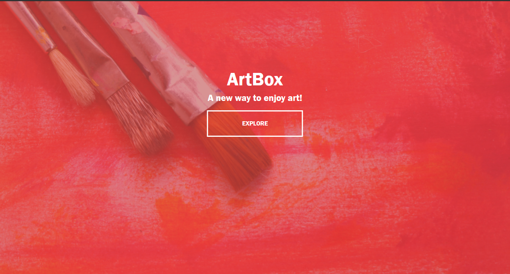

---

#Home Page
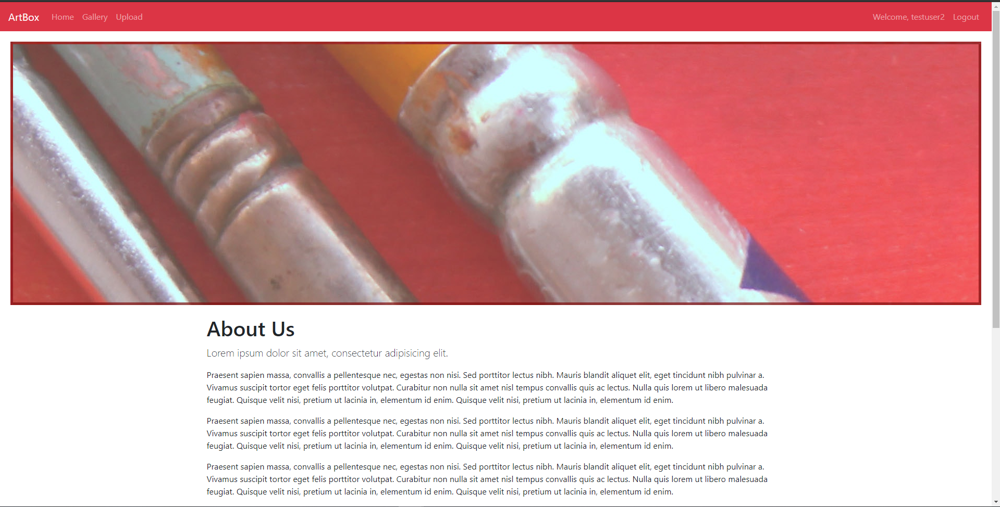  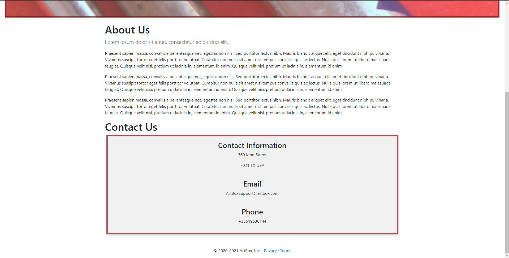

---

#Gallery Page
-Users who created a photo in gallery have edit and delete functionality and only certain user groups have upload functionality
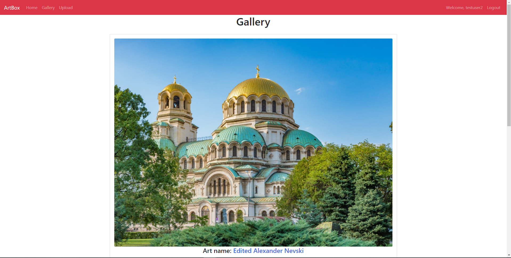  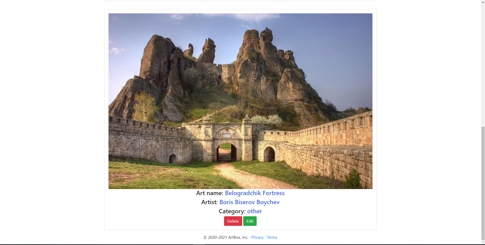  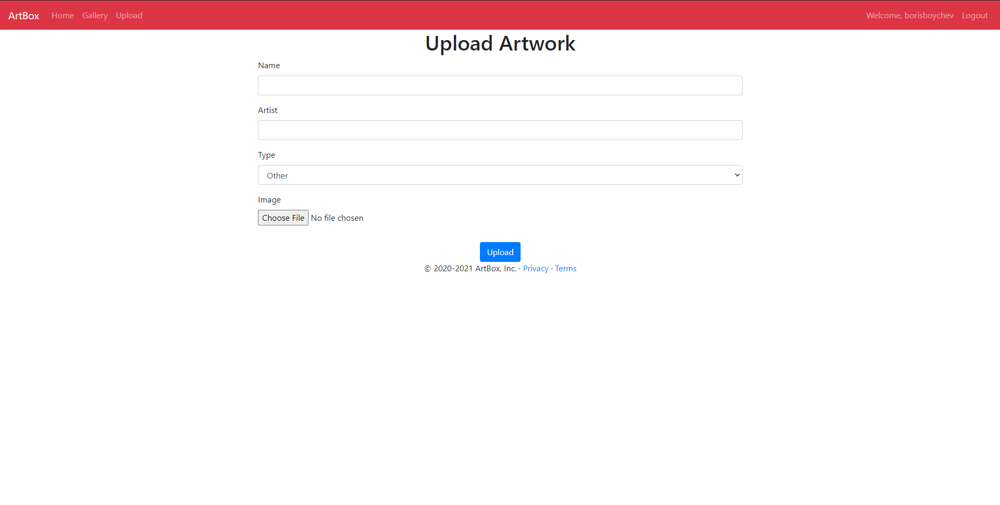

---

#Login And Register Page
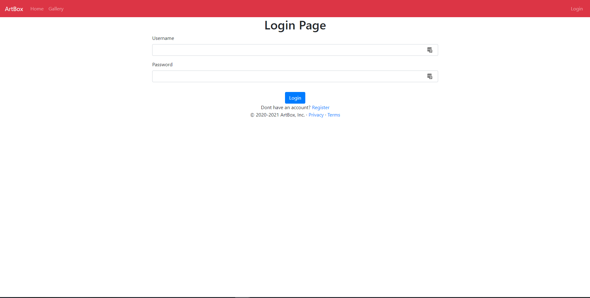
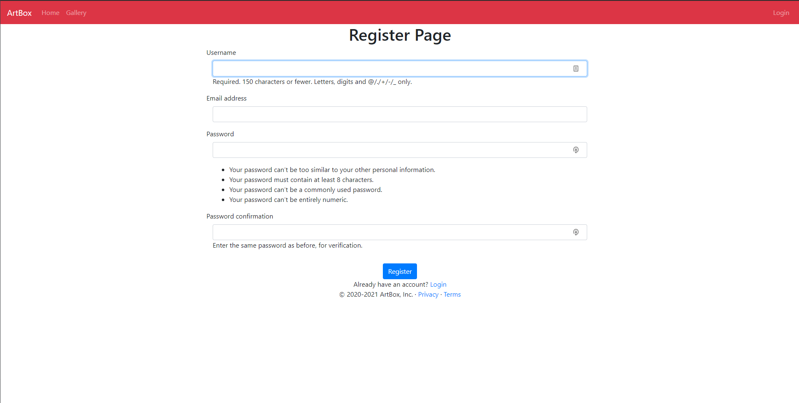

---

#Profile 
-When edition your profile not all fields are required and they wont be saved as blank
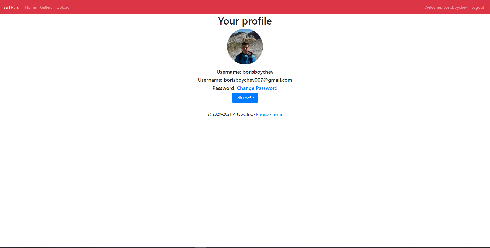
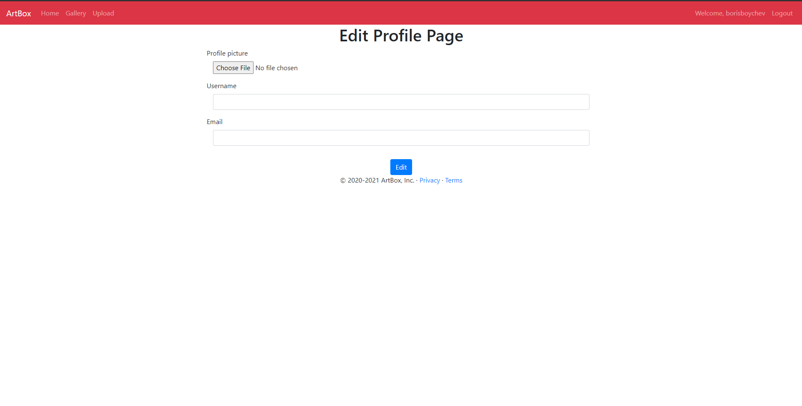
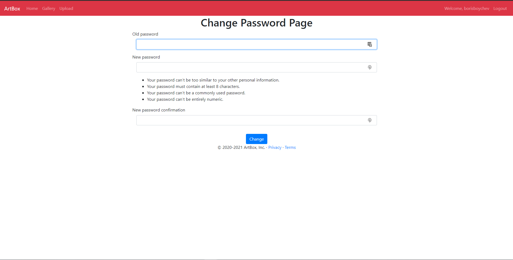
